# 🚀 Azure Enterprise Server: Secure Multi-Service Stack with Zero-Trust Architecture

## 📌 Project Abstract

This project demonstrates a **high-performance, security-focused multi-service server infrastructure** deployed on Microsoft Azure.  
Instead of relying on traditional exposed hosting models, the environment follows a **Zero-Port Exposure Strategy**, where public access is minimized and administrative access is tightly controlled.

Using **AlmaLinux 9**, **CyberPanel**, **OpenLiteSpeed**, and **Cloudflare Zero Trust**, the platform securely delivers:

- 🌐 Web Hosting Services  
- 📧 Business Mail Services  
- 🗄️ Database Services  
- 🔐 Hidden Origin IP Protection  
- 🛡️ Layered Security Controls

  <p align="center">
  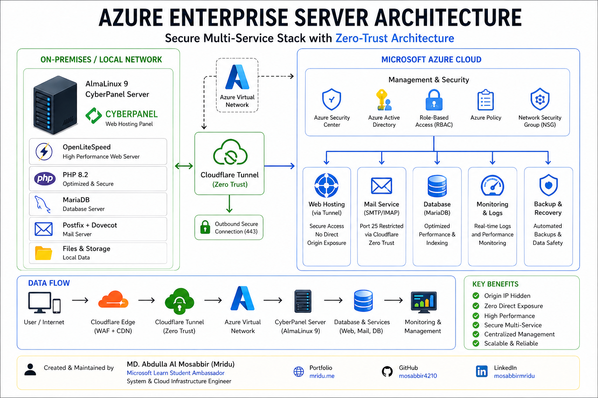
</p>

  ## 🎯 Why This Project Matters

This project demonstrates my hands-on ability to deploy, secure, optimize, and document a production-grade cloud server environment using Microsoft Azure and modern Zero Trust principles.

---

# 🏗️ Infrastructure Design & Provisioning

## 🖥️ Server Environment

| Component | Specification |
|----------|---------------|
| **Cloud Provider** | Microsoft Azure |
| **Compute Plan** | Standard B2s |
| **vCPU / RAM** | 2 vCPU / 4GB RAM |
| **Operating System** | AlmaLinux 9 (Gen 2) |
| **Storage** | 30GB Premium SSD |
| **Security Layer** | Azure NSG |


  <p align="center">
  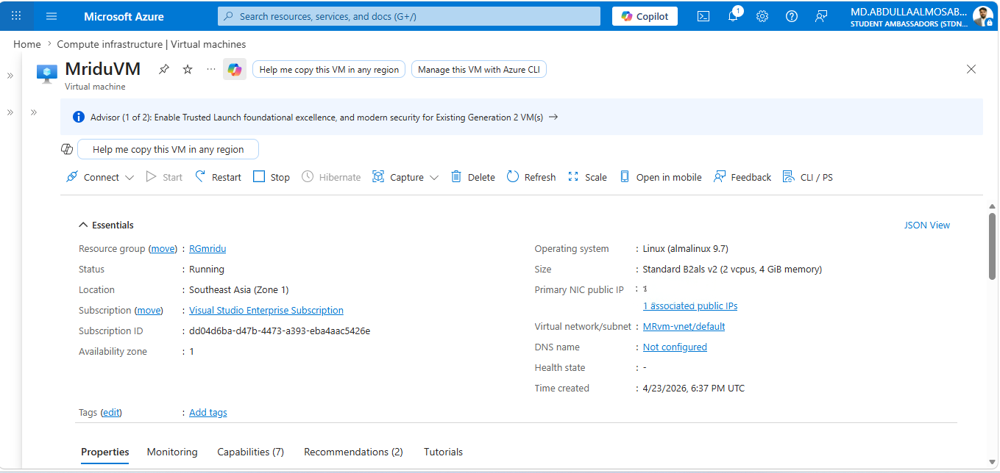
</p>

### 🔒 Network Security Model

- All inbound ports blocked by default  
- Port `22` (SSH) restricted to Admin IP only  
- Principle of least privilege applied  
- Reduced external attack surface  

---

# 🌐 Core Stack & Web Hosting

CyberPanel was selected for its native **OpenLiteSpeed** integration, offering higher efficiency and lower resource usage than traditional hosting stacks.

### ⚙️ Core Technologies

| Layer | Technology |
|------|------------|
| Control Panel | CyberPanel |
| Web Server | OpenLiteSpeed |
| Runtime | PHP 8.2 |
| Operating System | AlmaLinux 9 |
| CDN / Zero Trust | Cloudflare Tunnel + WAF |
| Database | MariaDB |
| Mail Stack | Postfix + Dovecot + SnappyMail |
| Monitoring | Zabbix + Grafana |
| Security | Azure NSG + SSL/TLS |
| Cloud Platform | Microsoft Azure |

---

# 🏗️ Phase 1: Infrastructure & OS Hardening

Before deploying production services, the operating system was updated, secured, and prepared with administrative utilities.

## 🔧 Initial System Update & Utilities

```bash
# Update all installed packages
sudo dnf update -y

# Install essential administration tools
sudo dnf install wget curl nano tar epel-release bzip2 -y

```
## 🔒 CyberPanel Installation with PHP 8.2 & OpenLiteSpeed

To build a complete web hosting environment, CyberPanel was installed with OpenLiteSpeed and PHP 8.2 for better speed, security, and management.

### 💻 Installation Command

```bash
sh <(curl https://cyberpanel.net/install.sh || wget -O - https://cyberpanel.net/install.sh)

```
# ⚙️ Recommended Installation Selections

| Option               | Selected Value    | Purpose                                 |
| -------------------- | ----------------- | --------------------------------------- |
| Web Server           | **OpenLiteSpeed** | High-performance lightweight web server |
| Panel Type           | **CyberPanel**    | Web hosting control panel               |
| Full Service Install | **Yes**           | Includes DNS, Mail, FTP services        |
| Remote MySQL         | **No**            | Uses local database server              |
| Memcached            | **Yes**           | Improves caching performance            |
| Redis                | **Yes**           | Fast object caching / session handling  |
| PHP Version          | **8.2**           | Modern PHP version for latest apps      |


## 🖥️ CyberPanel Dashboard

<p align="center">
  <a href="screenshorts/Cyberpanel.png">
    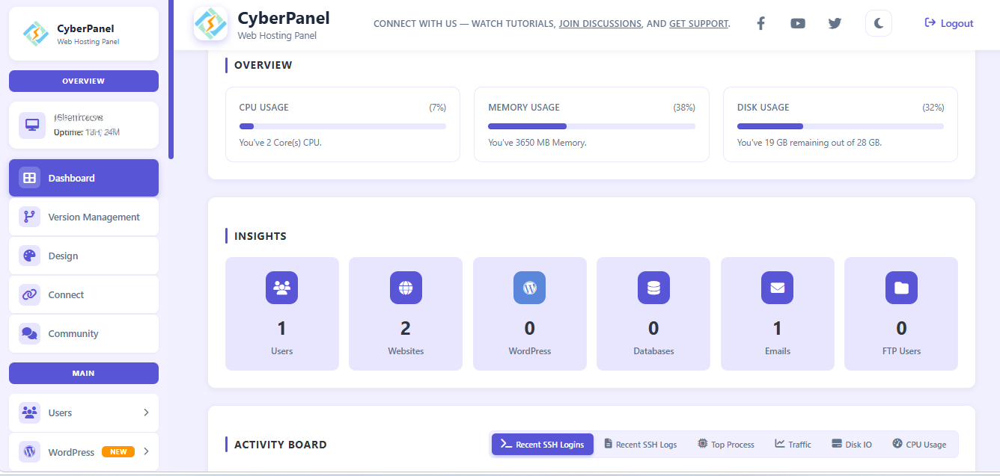
  </a>
</p>

<p align="center">
  <i>CyberPanel Control Panel managing OpenLiteSpeed, domains, and hosting services</i>
</p>

## 🔒: Zero-Trust Security (Cloudflare Tunnel)
This is the core security feature that hides the server's Origin IP.

1. Install Cloudflared Daemon
```bash
# Download and install the latest Cloudflared RPM
curl -L --output cloudflared.rpm https://github.com/cloudflare/cloudflared/releases/latest/download/cloudflared-linux-x86_64.rpm
sudo dnf localinstall cloudflared.rpm -y
```
# 2. Tunnel Authentication & Creation

```bash
# Authenticate with Cloudflare
cloudflared tunnel login

```
```bash

# Create the Tunnel
cloudflared tunnel create azure-enterprise-tunnel

# Verify the tunnel list
cloudflared tunnel list

```
## ☁️ Cloudflare Zero Trust Tunnel

<p align="center">
  <a href="screenshorts/CloudTunnel.png.png">
    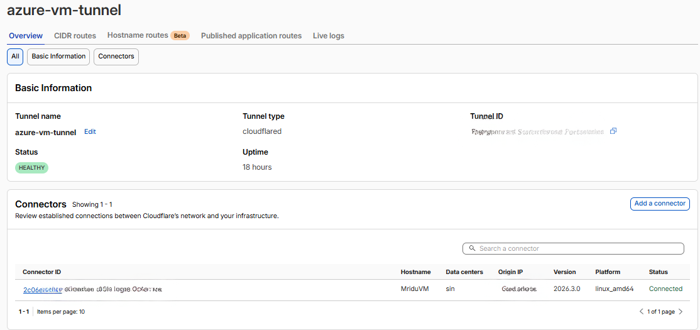
  </a>
</p>

<p align="center">
  <i>Cloudflare Tunnel securely exposing internal services without public IP exposure</i>
</p>

# 3. Routing Traffic (Ingress Rules)
**I configured the config.yml to map subdomains to internal ports**:

```bash
YAML
ingress:
  - hostname: panel.yourdomain.com
    service: http://localhost:8090
  - hostname: yourdomain.com
    service: http://localhost:80
  - service: http_status:404
```
# 4. Run as a System Service

```bash
# Install the tunnel as a background service
sudo cloudflared service install [Your-Tunnel-Token]
sudo systemctl start cloudflared
sudo systemctl enable cloudflared

```
## 📡 Cloudflare Tunnel Status

<p align="center">
  <a href="screenshorts/Tunnelstatus.png">
    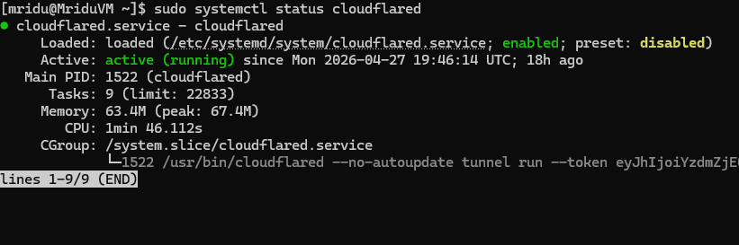
  </a>
</p>

<p align="center">
  <i>Real-time status monitoring of Cloudflare Tunnel ensuring secure and stable connectivity</i>
</p>

## 🛠️ Nginx Service Management ##

 **On AlmaLinux 9, Nginx is managed via systemctl. These are the daily operational commands**:

```bash

# Install Nginx (if not already present)
sudo dnf install nginx -y

# Start and Enable Nginx to run on boot
sudo systemctl enable --now nginx

# Check the current status of the server
sudo systemctl status nginx

# Reload Nginx (Use this after changing configs to avoid downtime)
sudo systemctl reload nginx

# Stop Nginx
sudo systemctl stop nginx

```
# 🔍 Configuration & Syntax Testing
Before restarting Nginx, you must always verify that your code is correct to prevent the server from crashing.

```bash

# Test Nginx configuration for syntax errors
sudo nginx -t

# Check the Nginx version and compiled modules
nginx -V

```

## 📂 File Paths & Directory Structure

A professional Nginx deployment should clearly document where critical files and folders are located:

| Component | Path | Purpose |
|-----------|------|---------|
| Main Configuration | `/etc/nginx/nginx.conf` | Core Nginx settings and global directives |
| Server Blocks (vHosts) | `/etc/nginx/conf.d/` | Store individual `.conf` files for each domain / virtual host |
| Default Web Root | `/usr/share/nginx/html` | Default location for website files |
| Access Log | `/var/log/nginx/access.log` | Records incoming client requests |
| Error Log | `/var/log/nginx/error.log` | Stores warnings, errors, and troubleshooting logs |

> 💡 Keeping these paths organized helps with maintenance, troubleshooting, and multi-site hosting.


## 🛡️ Security & Hardening Commands

For Security , you should demonstrate "Security by Obscurity."

```bash
Hide Nginx Version:
Open the config: sudo nano /etc/nginx/nginx.conf
Add this inside the http {} block:

Nginx
server_tokens off;

```
```bash
#Allow Nginx through the local firewall:

sudo firewall-cmd --permanent --add-service=http
sudo firewall-cmd --permanent --add-service=https
sudo firewall-cmd --reload

```
## 🔄 Reverse Proxy Snippet 

**If you were to use Nginx as a proxy for your CyberPanel or a Node.js app, the command to create the config would be**:

```bash

sudo nano /etc/nginx/conf.d/proxy.conf

#Then paste this professional block:

Nginx
server {
    listen 80;
    server_name yourdomain.com;

    location / {
        proxy_pass http://127.0.0.1:8090; # Forwarding to CyberPanel
        proxy_set_header Host $host;
        proxy_set_header X-Real-IP $remote_addr;
        proxy_set_header X-Forwarded-For $proxy_add_x_forwarded_for;
    }
}

```

## ⚡ PHP 8.2 Deployment & Performance Optimization

### 1️⃣ Install PHP 8.2 with Common Extensions

```bash
sudo dnf install lsphp82 lsphp82-common lsphp82-mysqlnd lsphp82-gd \
lsphp82-process lsphp82-mbstring lsphp82-xml lsphp82-opcache -y

```
# 📦 Installed Modules

| Module     | Purpose                      |
| ---------- | ---------------------------- |
| `mysqlnd`  | MySQL / MariaDB connectivity |
| `gd`       | Image processing             |
| `mbstring` | Multi-byte character support |
| `xml`      | XML parsing                  |
| `opcache`  | PHP code acceleration        |

## 🐘 PHP 8.2 Configuration & Modules

<p align="center">
  <a href="screenshorts/PHPVersion.png">
    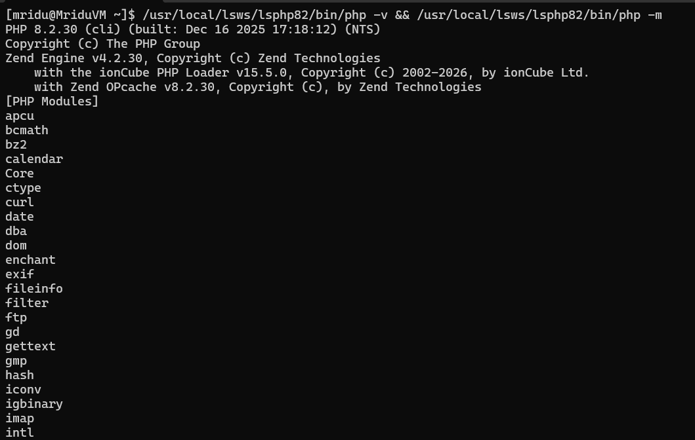
  </a>
</p>

<p align="center">
  <i>Verification of PHP 8.2 runtime and enabled modules in LiteSpeed environment</i>
</p>
2️⃣ PHP Configuration (php.ini)

To support professional web applications, media uploads, and stable execution, the PHP runtime was optimized.

# 📄 File Path

**/usr/local/lsws/lsphp82/etc/php.ini**

✏️ Edit Configuration

```bash
sudo nano /usr/local/lsws/lsphp82/etc/php.ini

```

# 🔧 Recommended Settings

| Setting               | Value        | Purpose                          |
| --------------------- | ------------ | -------------------------------- |
| `memory_limit`        | `256M`       | More RAM for heavy scripts       |
| `upload_max_filesize` | `64M`        | Larger file uploads              |
| `post_max_size`       | `64M`        | Supports bigger form submissions |
| `max_execution_time`  | `300`        | Prevents timeout on long tasks   |
| `date.timezone`       | `Asia/Dhaka` | Correct local timestamps         |

### 🐘 PHP Configuration Preview

<p align="center">
  <a href="screenshorts/phppip.png">
    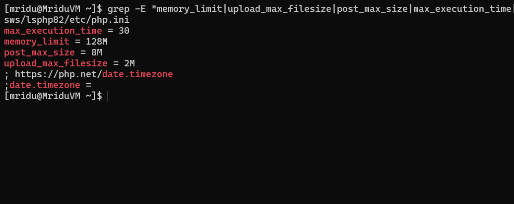
  </a>
</p>

<p align="center">
  <i>Production-optimized php.ini configuration for performance and stability</i>
</p>

# 3️⃣ OPcache Performance Boost

**OPcache stores precompiled PHP bytecode in memory, improving speed and reducing CPU usage.**

```bash

zend_extension=opcache.so
opcache.enable=1
opcache.memory_consumption=128

```
# 4️⃣ Verify PHP Status
```bash
# Check PHP version
/usr/local/lsws/lsphp82/bin/php -v

# List installed modules

/usr/local/lsws/lsphp82/bin/php -m

```
# 5️⃣ Apply Configuration Change
```bash
killall lsphp

```

# 🗄️ Database Management (MariaDB / MySQL)

In this project, **MariaDB** — a community-developed fork of MySQL — was used as the primary database engine due to its strong performance, stability, and full compatibility with AlmaLinux 9.

### 💡 Why MariaDB?

- High performance for web applications  
- Fully compatible with MySQL syntax and tools  
- Reliable for production environments  
- Open-source and actively maintained  
- Optimized for Linux hosting servers  

---

## ⚙️ Service Administration

Database services were managed through `systemctl` to monitor status, start, stop, and restart operations when required.

```bash
# Check database service status
sudo systemctl status mariadb

# Start service
sudo systemctl start mariadb

# Restart service
sudo systemctl restart mariadb

# Enable on boot
sudo systemctl enable mariadb
# Start and Enable MariaDB on boot
sudo systemctl enable --now mariadb

# Check MariaDB version
mysql -V

```
## 🗄️ MariaDB Service Status

<p align="center">
  <a href="screenshorts/DBstatus.png">
    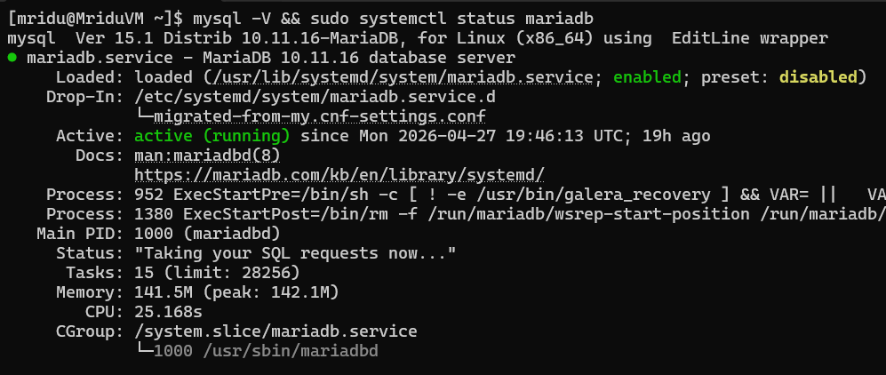
  </a>
</p>

<p align="center">
  <i>MariaDB service running and verified via systemctl status</i>
</p>

# 2. Security Hardening

**After installation, I ran the security script to remove anonymous users and secure the root access**:

```bash

# Secure the installation
sudo mysql_secure_installation

```
**Actions taken: Set root password, removed anonymous users, disallowed root login remotely, and removed the test database.**


# 📧 Enterprise Mail Service Architecture

**This phase covers the deployment of core mail services, authentication readiness, and preparation for reliable outbound email delivery in a cloud environment.**

---

## 🏗️ Core Mail Components

| Service | Role | Purpose |
|--------|------|---------|
| **Postfix** | MTA | Handles sending and receiving emails |
| **Dovecot** | MDA / IMAP / POP3 | Manages mailbox storage and user access |
| **SnappyMail** | Webmail Interface | Lightweight modern browser-based email client |

### 💡 Why This Stack?

- Reliable email delivery  
- Secure mailbox access  
- Webmail from any browser  
- Lightweight and production ready  

---

## ⚙️ Service Management Commands

**To verify services are running correctly and restart after configuration changes:**

```bash
# Check service status
sudo systemctl status postfix
sudo systemctl status dovecot

# Restart mail services
sudo systemctl restart postfix dovecot

```
### 🧪 Mail Verification Output

<p align="center">
  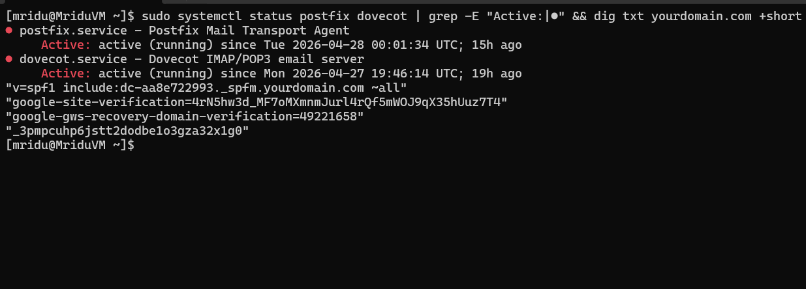
</p>

<p align="center">
  <i>Postfix & Dovecot running with DNS SPF verification</i>
</p>
# ✅ Operational Benefit

**This architecture provides a complete self-hosted business email platform with SMTP, IMAP, POP3, and webmail access**

## 🌐 DNS Engineering for Email Deliverability

**Setting up the mail server software is only 50% of the job — the other 50% is proper DNS configuration to ensure emails land in the Inbox instead of Spam.**

### 📌 Core DNS Records Configured

| Record Type | Purpose | Example Value |
|------------|---------|---------------|
| **SPF** | Authorizes your server to send emails for the domain | `v=spf1 ip4:[Your_Azure_Public_IP] +a +mx ~all` |
| **DKIM** | Adds a digital signature to outgoing emails for trust verification | Generated via CyberPanel → Mail → DKIM Manager |
| **DMARC** | Tells receiving servers how to handle SPF/DKIM failures | `v=DMARC1; p=quarantine; adkim=r; aspf=r` |

### 💡 Why It Matters

These records improve email reputation, reduce spoofing risk, and significantly increase inbox delivery rates.

---

## 🔒 SSL/TLS Encryption for Mail

Emails should be encrypted during transmission for privacy and trust.

I used **Let's Encrypt SSL** via CyberPanel to secure the mail server hostname.

### ✅ Benefits

- Encrypts SMTP / IMAP / POP3 traffic  
- Prevents interception during transit  
- Improves trust with receiving mail providers  
- Required for modern secure email delivery

```bash

# Command to check if the mail certificate is valid
openssl s_client -connect mail.yourdomain.com:465

```
## ☁️ Handling Azure Port 25 Restrictions

By default, Microsoft Azure restricts outbound traffic on **Port 25** to reduce spam and abuse risks.  
To ensure reliable email sending, two professional methods were practiced.

### 📌 Solutions Implemented

| Method | Description | Benefit |
|-------|-------------|---------|
| **Request Port 25 Unblock** | Submit a request to Azure Support for outbound SMTP access | Enables direct mail relay from the server |
| **Use Submission Ports** | Configure mail clients to use authenticated SMTP ports | More secure and commonly recommended |

### 🔧 Recommended SMTP Ports

| Port | Encryption | Usage |
|------|------------|------|
| `587` | STARTTLS | Standard authenticated mail submission |
| `465` | SSL/TLS | Secure SMTP connection |
| `25` | Plain / Relay | Server-to-server mail transfer |

### 💡 Best Practice

For modern hosting environments, using **Port 587** or **Port 465** is preferred for secure authenticated email delivery.

### ✅ Result

**This approach helps bypass cloud provider restrictions while maintaining secure and professional email operations**.

# 📧 Mail Server Testing & Troubleshooting (CLI Tools)

As a professional system administrator, validating mail services through the command line is essential for diagnosing SMTP connectivity and monitoring live server activity.

---

### 🔍 SMTP Connectivity Test

Use Telnet to manually verify whether the local SMTP service is responding on Port `25`.

```bash
# Test SMTP connection to local mail service
telnet localhost 25

```
### 📜 Real-Time Mail Log Monitoring

**Monitor the mail server logs live to detect sending, receiving, authentication, or delivery errors.**
```bash
# Watch mail logs in real-time
sudo tail -f /var/log/maillog

```
## 🛠️ Troubleshooting & Problem Solving

During the deployment, several challenges were addressed:
- **Port 25 Restriction:** Azure blocks outbound port 25. This was resolved by implementing secure SMTP submission via ports **465** and **587**.
- **Tunnel Connectivity:** Addressed initial daemon crashes by configuring `cloudflared` as a persistent **Systemd** service.
- **Permission Issues:** Fixed PHP execution errors by correctly mapping the `lshttpd` user permissions within the AlmaLinux filesystem.

# 🌐  Production Case Study – Live Portfolio Deployment

The final validation of this infrastructure was the successful deployment of a professional, high-availability portfolio website.  
This live environment demonstrates the effectiveness of the **Zero-Trust Security Model** and **Performance Optimization Strategy** implemented throughout the project.

---

## 🔗 Live Access

| Item | Status |
|------|--------|
| **Primary Domain** | `mridu.me` |
| **Availability** | 🟢 Live & Production Ready |
| **Security Layer** | Origin IP Hidden via Cloudflare Tunnel |
| **SSL Status** | HTTPS Enabled |

---

## 🛠️ Deployment Configuration

| Feature | Implementation |
|--------|----------------|
| **Hosting Platform** | CyberPanel + OpenLiteSpeed |
| **Runtime Environment** | PHP 8.2 |
| **Content Delivery** | Cloudflare Edge Network |
| **SSL/TLS** | Let's Encrypt (Auto Renewing) |
| **Database Engine** | MariaDB (Optimized) |

---

## ⚡ Performance & Optimization

Enterprise-grade performance was achieved through the following enhancements:

| Optimization | Benefit |
|-------------|---------|
| **LSCache Integration** | Reduced Time to First Byte (TTFB) |
| **Gzip / Brotli Compression** | Smaller asset size & faster loading |
| **OPcache Tuning** | Faster PHP execution |
| **LiteSpeed Engine** | High concurrency with low resource usage |

---
## ⚡ Performance Analytics (Cloudflare)

<p align="center">
  <a href="screenshorts/performance-analytics-cloudflare.png">
    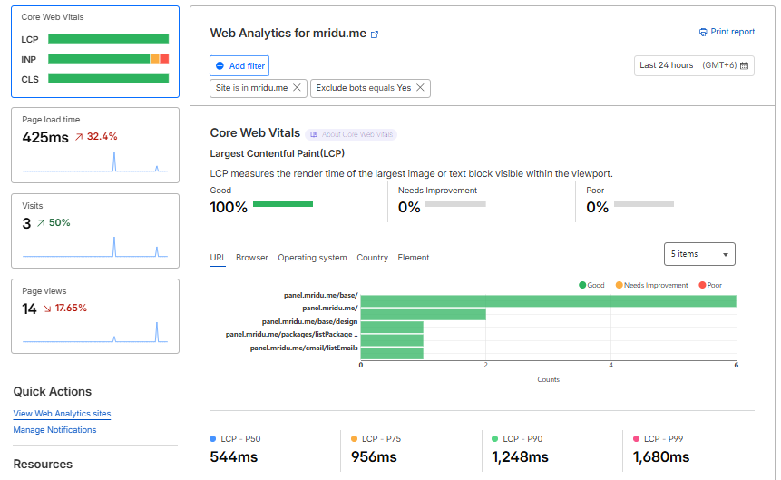
  </a>
</p>

<p align="center">
  <i>Cloudflare analytics showing optimized traffic delivery, caching efficiency, and reduced latency</i>
</p>

## 🛡️ Security Posture

| Security Layer | Protection |
|---------------|------------|
| **Cloudflare WAF** | Blocks malicious traffic & bots |
| **Cloudflare Tunnel** | Hides origin server IP |
| **SSL Offloading** | Encryption handled at edge |
| **Azure NSG** | Strict inbound traffic control |

---
## 🔗 Live Access

| Item | Details |
|------|---------|
| **Primary Domain** | `https://mridu.me` |
| **Status** | 🟢 Live & Production Ready |
| **Security** | Origin IP Hidden via Cloudflare Tunnel |
| **SSL/TLS** | HTTPS Enabled |
| **Availability** | Publicly Accessible with Protected Backend |

## 🌐 Live Website Preview

<p align="center">
  <a href="https://mridu.me" target="_blank">
    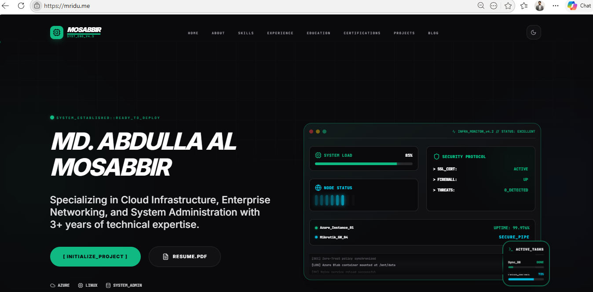
  </a>
</p>

<p align="center">
  <i>Live production portfolio deployed on Azure with Cloudflare Zero Trust security</i>
</p>

### ✅ Deployment Summary

**The website is running in a secure production environment with Cloudflare edge protection, encrypted HTTPS traffic, and hidden server origin infrastructure.**

## ✅ Business Outcome

- Professional live portfolio website  
- Fast global content delivery  
- Hardened production security  
- Lower server resource usage  
- Scalable cloud-ready architecture  

---
# 📊 Enterprise Infrastructure Monitoring (Zabbix & Grafana)

To ensure **high availability**, proactive maintenance, and real-time visibility, a centralized monitoring solution was implemented to continuously track infrastructure health, performance metrics, and critical services.

---

## 🛠️ Monitoring Stack

| Component | Role | Purpose |
|----------|------|---------|
| **Zabbix Server** | Monitoring Core | Collects metrics, triggers alerts, and manages hosts |
| **Zabbix Agent** | Endpoint Telemetry | Installed on AlmaLinux 9 server to send system data |
| **Grafana** | Visualization Layer | Creates modern dashboards and analytics panels |
| **MariaDB** | Data Storage | Stores monitoring history and trends |

---

## 📈 Metrics Tracked

| Metric Category | Indicators Monitored |
|----------------|----------------------|
| **System Resources** | CPU Load, RAM Usage, Disk I/O, SWAP Performance |
| **Service Uptime** | OpenLiteSpeed, MariaDB, Postfix Status |
| **Network Traffic** | Inbound / Outbound Bandwidth, Tunnel Stability |
| **Security Alerts** | SSH Brute-force Attempts, Suspicious Log Events |
| **Disk Health** | Filesystem Usage, Low Space Warnings |

---

## ⚡ Operational Benefits

- Real-time server health monitoring  
- Instant alerts before outages occur  
- Historical performance analytics  
- Better capacity planning  
- Improved uptime and reliability  

---

## 🖥️ Dashboard Visibility

Grafana dashboards were integrated with Zabbix data sources to provide:

- CPU / RAM live graphs  
- Network throughput charts  
- Service availability panels  
- Alert trends & historical analytics  

---

## ✅ Result

A production-ready observability stack that improves server stability, troubleshooting speed, and enterprise-grade operational awareness.

## 🚀 Live Proof of Concept

This deployment serves as a real-world showcase of secure cloud hosting, web optimization, and production-grade infrastructure engineering.

## 📜 License
This project is licensed under the **MIT License**. You are free to use, modify, and distribute this architecture for your own needs.

---
*Created and Maintained by **MD. Abdulla Al Mosabbir** (Microsoft Learn Student Ambassador | System & Cloud Infrastructure Engineer)*

